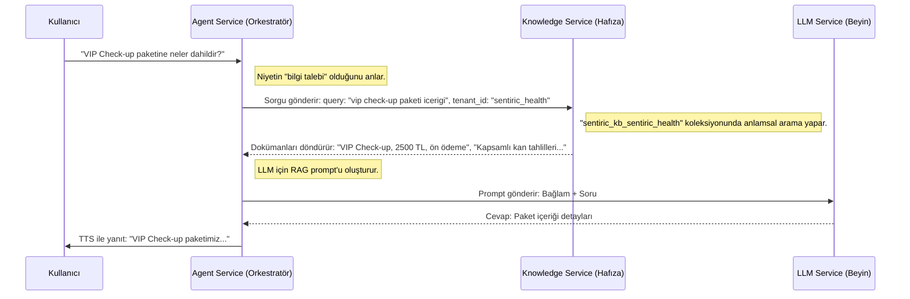

# 🧠 Sentiric Knowledge Service - Mantık ve Akış Mimarisi

**Belge Amacı:** Bu doküman, `sentiric-knowledge-service`'in Sentiric platformu içindeki stratejik rolünü, temel çalışma prensiplerini ve diğer servislerle olan etkileşim akışını (diyalogları) detaylı bir şekilde açıklamaktadır. `TASKS.md` dosyası "ne inşa edileceğini" anlatırken, bu doküman "neden ve nasıl çalıştığını" anlatır.

---

## 1. Stratejik Rol: "Kurumsal Hafıza" (The Corporate Memory)

`sentiric-knowledge-service`, platformun **kurumsal hafızasıdır**. Temel görevi, `agent-service`'in beynini (LLM) dış ve dinamik bilgilerle beslemektir. Bu, modern RAG (Retrieval-Augmented Generation) mimarisinin kalbidir.

**Bu servis sayesinde platform:**
1.  **Daha Doğru Olur:** Yapay zeka, bilmediği konularda tahmin yürütmek yerine, bu servisten aldığı kesin bilgilere dayanarak cevap verir (halüsinasyonları önler).
2.  **Daha Esnek Olur:** Bir ürünün fiyatı değiştiğinde kod değişikliği gerekmez; sadece bu servisin okuduğu bir veri kaynağını (veritabanı, `.md` dosyası vb.) güncellemek yeterlidir.
3.  **Daha Güvenli Olur:** Her kiracının (`tenant`) bilgi bankası tamamen izole edilmiştir. `sentiric_health` kiracısı, `sentiric_travel` kiracısının verilerine **asla** erişemez.

---

## 2. Temel Çalışma Prensibi: İndeksleme ve Sorgulama

Servis iki ana modda çalışır:

*   **İndeksleme (Başlangıçta):** Servis ilk ayağa kalktığında, PostgreSQL'deki `datasources` tablosunu okur. Her bir kiracı için tanımlanmış tüm veri kaynaklarını (veritabanı tabloları, web siteleri, dosyalar) paralel olarak yükler, bunları anlamsal vektörlere dönüştürür ve Qdrant veritabanında her kiracı için ayrı bir "koleksiyon" (collection) içine kaydeder.
*   **Sorgulama (Çalışma Zamanında):** Diğer servislerden `/api/v1/query` endpoint'ine bir istek geldiğinde, gelen sorguyu anında bir vektöre dönüştürür ve sadece ilgili kiracının koleksiyonunda anlamsal olarak en benzer dokümanları bularak geri döner.

---

## 3. Uçtan Uca Diyalog Akışı: Bir Bilgi Talebinin Anatomisi

Kullanıcının sorduğu bir sorunun `knowledge-service` tarafından nasıl zenginleştirildiğini gösteren tam akış aşağıdadır.

**Senaryo:** `sentiric_health` kiracısını arayan bir kullanıcı, "VIP Check-up paketine neler dahildir?" diye soruyor.

